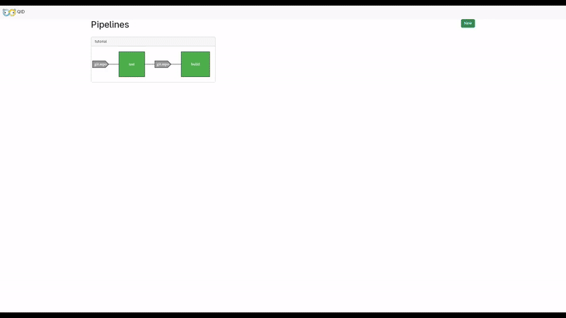

    

# QID (Queue CI/CD)

QID is a CI/CD based on Queues, meaning that the ones running the Jobs are basically queue workers.

:warning: This is still a PoC and under heavily development, may cause breaking changes on the API or configuration :warning:

## Why?

QID is heavily inspired in [ConcourseCI](https://concourse-ci.org/) and basically trying to make a simple
configuration (HCL instead of YAML) and simple installation/usage by allowing to run everything even in-memory
(workers and DB) for small usecases.

## Documentation

The full documentation is available at [docs/README.md](./docs/README.md)
