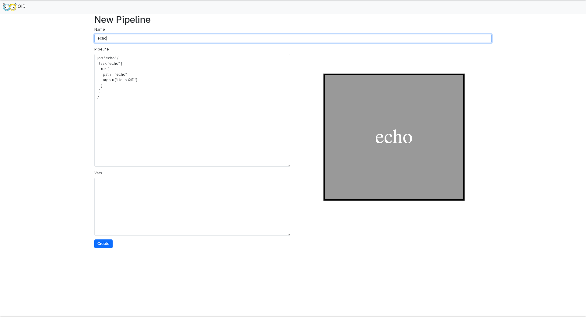
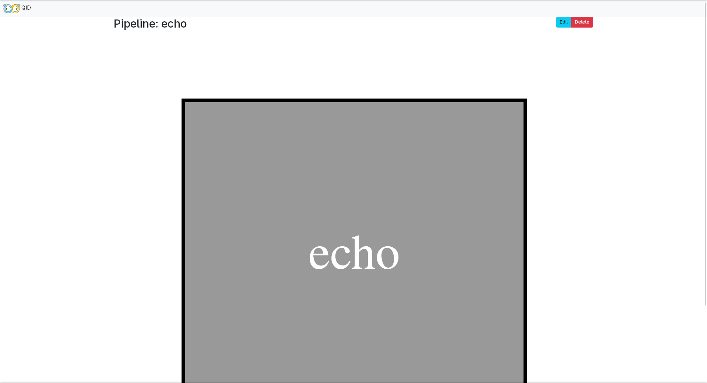
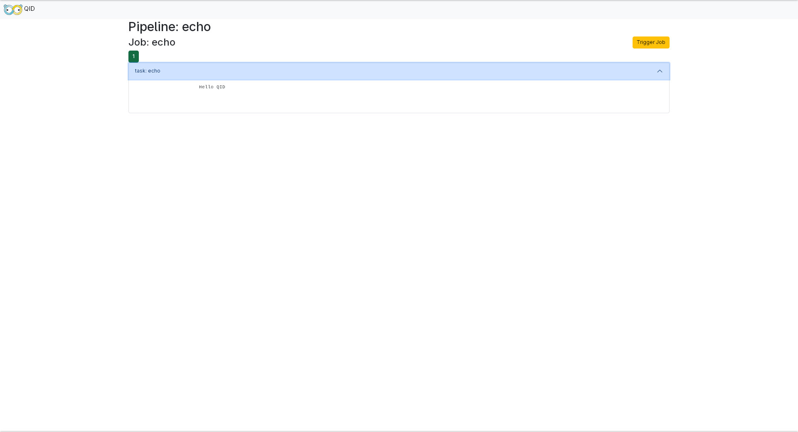
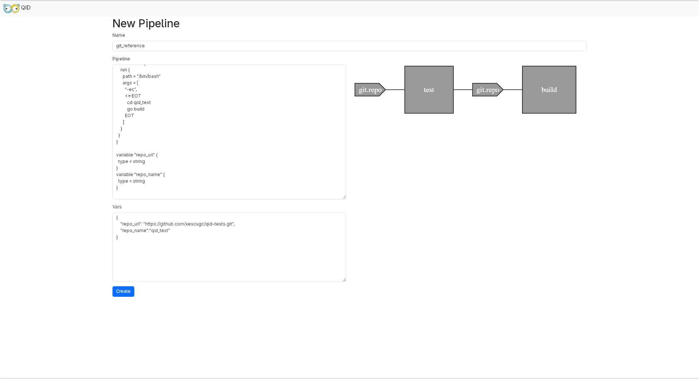
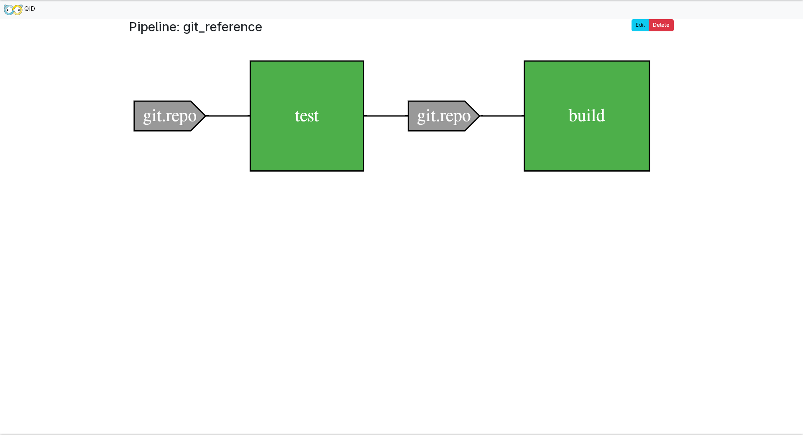
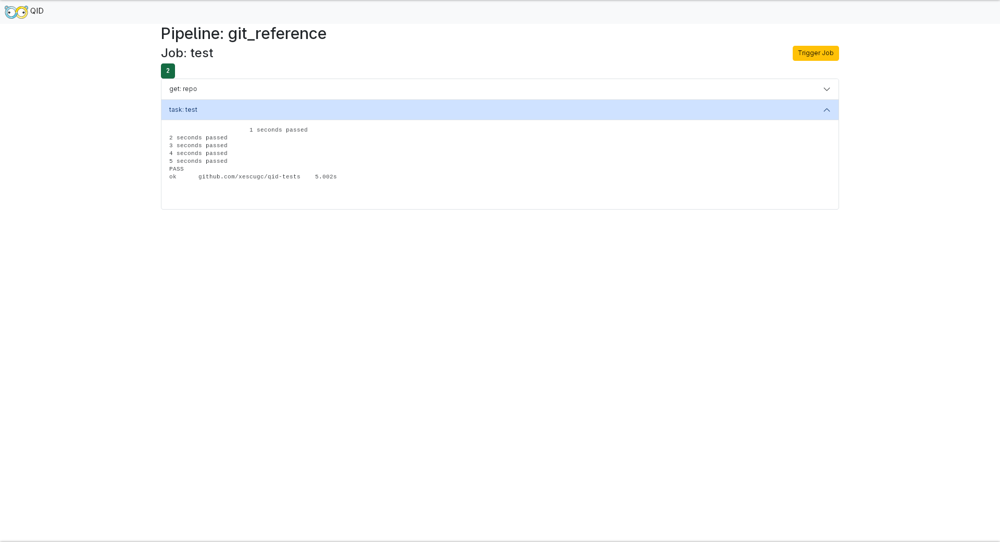

# Tutorial

For this tutorial we assume QID is [installed](https://github.com/xescugc/qid/releases) ad we'll use local everything (so the default behavior) so we can just focus on how it works.

We'll create an easy pipeline that will test your code once a new change is detected on the main branch

## Start the server

Run `qid server` and then you'll have it running in `localhost:8080`. Going there you'll see the Pipelines view (empty)

## Creating a Pipeline

On that Pipelines view on the top right you have the `New` that will bring you to the view to create a Pipeline.

There you can set the:
* `Name`: Name of the Pipeline (has to be unique)
* `Pipeline`: Which is the actual Pipeline configuration HCL
* `Vars`: Which is the special variables to set on the HCL (if any).

We'll start simple with a Job that can echo, paste this into the `Pipeline`

```hcl
job "echo" {
  task "echo" {
    run {
      path = "echo"
      args = ["Hello QID"]
    }
  }
}
```

<p align="center">
    
</p>

Name it `echo` to keep it more redundant (haha). Now if you click outside of the configuration, on the right side you'll see the Pipeline which only
has the Job `echo`.

Click create and go to the next step.

## Pipeline visualization, Jobs and Builds

After the Create you'll be redirected to the Pipeline view (yes it's big haha) with our Pipeline `echo` and our Job `echo`.

<p align="center">
    
</p>

As there is no resource linked to it it'll never be triggered automatically, but we can do that manually.

Click on the Job `echo` (the box) and you'll be redirected to the Builds view, which shows all the builds that the Job
has had, which now is empty. To run one manually let's click on `Trigge Job`.

You'll see the Build appear and if you click on it you'll see the output of the `task: echo` which is the `Hello QID`.

<p align="center">
    
</p>

Builds have 3 status: `started`(yellow), `succeeded`(green) and `failed`(red). We only see the `succeeded` as it's too simple of a job.

Perfect we created our first Pipeline and ran our first Job! Next is gonna be a bit more complex example.

## Git resource

:warning: As the workers run locally, for this example to work you need `go` and be on a linux OS because the repo I'm using is a simple go one but you can still follow it :warning:

Now we are gonna create a new Pipeline, click on the top left, you'll see the previous Pipeline `echo` on the list. Click on `New` and paste the following configuration.

```hcl
resource_type "git" {
  inputs = [
    "url",
    "name",
  ]
  check {
    path = "/bin/bash"
    args = [
      "-ec",
      <<-EOT
        git clone --quiet $URL $NAME
        cd $NAME
        if [[ -n $LAST_VERSION_HASH ]]; then
          git log $LAST_VERSION_HASH..HEAD --pretty=format:"%H"
        else
          git log -1 --pretty=format:"%H"
        fi
      EOT
    ]
  }
  pull {
    path = "/bin/sh"
    args = [
      "-ec",
      <<-EOT
        git clone $URL $NAME
        cd $NAME
        git checkout $VERSION_HASH
      EOT
    ]
  }
  push {}
}

resource "git" "repo" {
  url = var.repo_url 
  name = var.repo_name 
}

job "test" {
  get "git" "repo" {
    trigger = true
  }
  task "test" {
    run {
      path = "/bin/bash"
      args = [
        "-ec",
        <<-EOT
          cd qid_test
          go test
        EOT
      ]
    }
  }
}

job "build" {
  get "git" "repo" {
    passed = ["test"]
    trigger = true
  }
  task "build" {
    run {
      path = "/bin/bash"
      args = [
        "-ec",
        <<-EOT
          cd qid_test
          go build
        EOT
      ]
    }
  }
}

variable "repo_url" {
  type = string
}
variable "repo_name" {
  type = string
}
```

Once you click out you'll see an error: `failed to read Pipeline: variable "repo_url" has an invalid default type, expected 'string'`. This is because
we defined some variables on the Pipeline and need to be set.

To set them paste this JSON onto the `Vars`:

```json
{
    "repo_url": "https://github.com/xescugc/qid-tests.git",
    "repo_name":"qid_test"
}
```

<p align="center">
    
</p>

To be able to test things on your side fork the `repo_url` and use that new URL for your pipeline

This example pulls form the `repo_url` and listen for changes on it, once something changes first the Job `test` will be run and then the Job `build`.

So now we click `Create` and we'll see the firs build that runs as there is nothing on the DB so the first check is a success.

<p align="center">
    
</p>
<p align="center">
    
</p>

And this would be all for the small Tutorial in how to use QID
