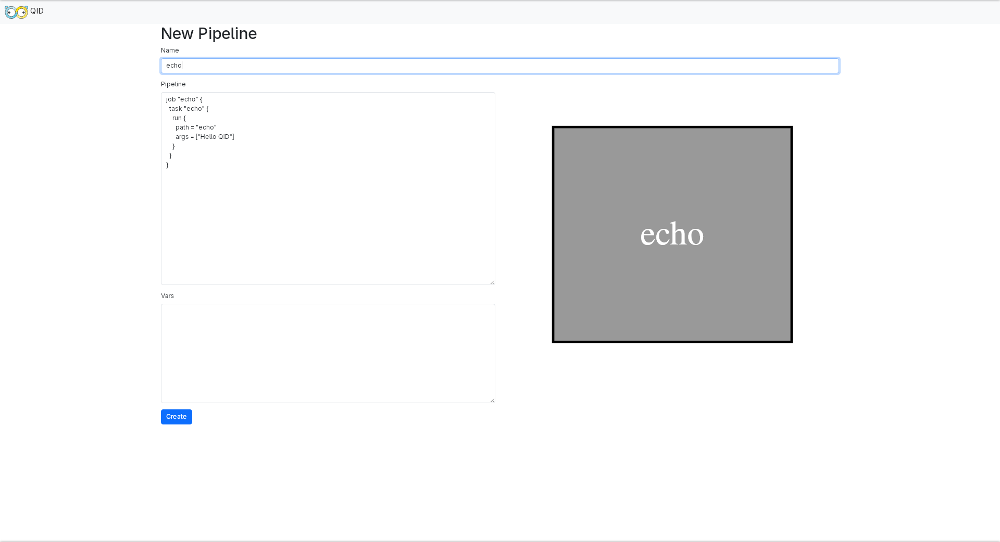
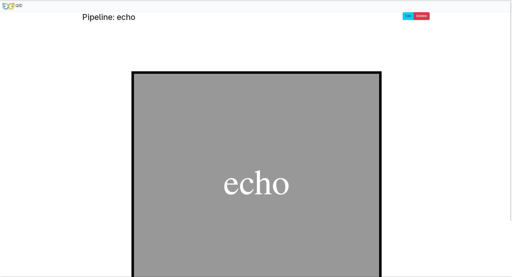
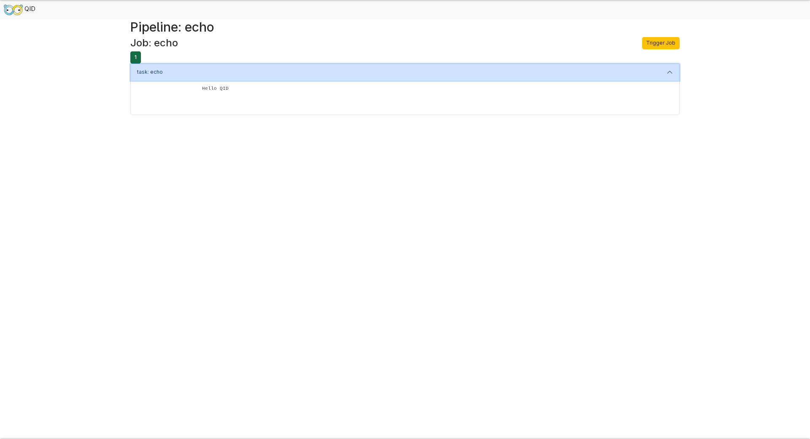
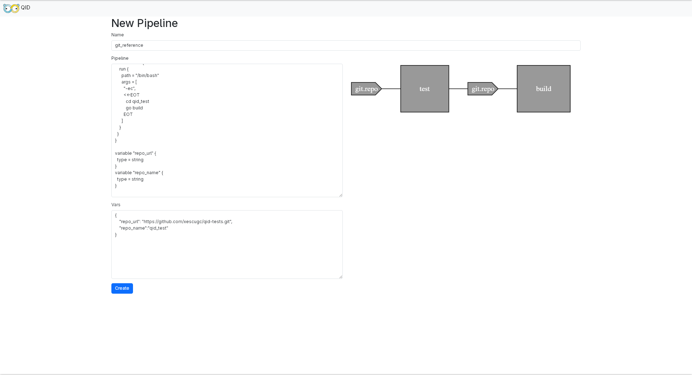
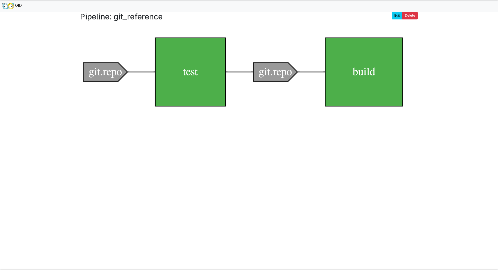
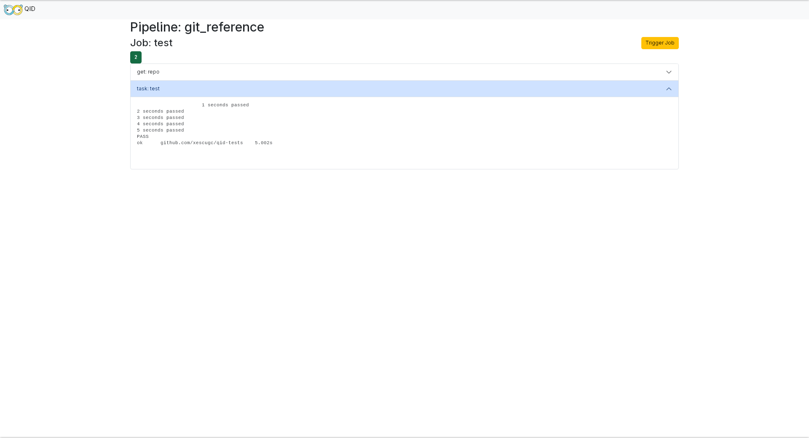

# Tutorial

For this tutorial we assume QID is [installed](https://github.com/xescugc/qid/releases) and we'll use local everything (the default behavior) so we can focus on how it works.

We'll create an easy pipeline that will test your code once a new change is detected on the main branch

## Start the server

Run the server with a JWT secret and an initial user:

```
qid server --jwt-secret mysecret --users 'admin:$2a$14$...'
```

To generate the hashed password use `qid user-password --username admin --password admin123` and pass the output to `--users`.

For a quick test with in-memory storage (the default), you can run:

```
qid server --jwt-secret mysecret --users 'admin:$2a$14$rwQk8Qvc2rij7qhFO4P1W.OiSF6AkgVU1RCrLaY2wawJcpkPEKwbm'
```

This creates an `admin` user with password `admin123`. Then go to `localhost:8080`.

## Log In

You'll see a Log In screen. Enter the username and password you configured (e.g. `admin` / `admin123`). After login you'll see the Teams view. A default `Main` team is created automatically.

Click `Pipelines` on the Main team to see the Pipelines view (empty).

## Creating a Pipeline

On that Pipelines view on the top right you have the `New` button (visible only to team admins) that will bring you to the view to create a Pipeline.

There you can set the:
* `Name`: Name of the Pipeline (has to be unique)
* `Pipeline`: Which is the actual Pipeline configuration HCL
* `Vars`: Which is the special variables to set on the HCL (if any).

We'll start simple with a Job that can echo, paste this into the `Pipeline`

```hcl
job "echo" {
  task "echo" {
    run "exec" {
      path = "echo"
      args = ["Hello QID"]
    }
  }
}
```

<p align="center">
    
</p>

Name it `echo`. Now if you click outside of the configuration, on the right side you'll see the Pipeline which only
has the Job `echo`.

Click create and go to the next step.

## Pipeline visualization, Jobs and Builds

After the Create you'll be redirected to the Pipeline view (yes it's big haha) with our Pipeline `echo` and our Job `echo`.

<p align="center">
    
</p>

As there is no resource linked to it it'll never be triggered automatically, but we can do that manually.

Click on the Job `echo` (the box) and you'll be redirected to the Builds view, which shows all the builds that the Job
has had, which is now empty. To run one manually, click on `Trigger Job`.

You'll see the Build appear and if you click on it you'll see the output of the `task: echo` which is the `Hello QID`.

<p align="center">
    
</p>

Builds have 3 status: `started`(yellow), `succeeded`(green) and `failed`(red). We only see the `succeeded` as it's too simple of a job.

Perfect we created our first Pipeline and ran our first Job! Next is gonna be a bit more complex example.

## Git resource

:warning: As the workers run locally, for this example to work you need `go` and be on a Linux OS because the repo I'm using is a simple go one but you can still follow it :warning:

Now we are gonna create a new Pipeline, click on the top left, you'll see the previous Pipeline `echo` on the list. Click on `New` and paste the following configuration.

```hcl
resource_type "git" {
  params = [
    "url",
    "name",
  ]
  check "exec" {
    path = "/bin/sh"
    args = <<-EOT
        '-ec'
        'git clone --quiet $param_url $param_name
        cd $param_name
        if [[ -n $version_ref ]]; then
          git log $version_ref..HEAD --pretty=format:"%H" | jq -Rsc "(. / \"\n\" | map(select(length>0) | { "ref": . }))"
        else
          git log -1 --pretty=format:"%H" | jq -Rsc "(. / \"\n\" | map(select(length>0) | { "ref": . }))"
        fi'
      EOT
  }
  pull "exec" {
    path = "/bin/sh"
    args = <<-EOT
        '-ec'
        'git clone $param_url $param_name
        cd $param_name
        git checkout $version_ref'
      EOT
  }
  push "exec" { }
}

resource "git" "repo" {
  params {
    url = var.repo_url 
    name = var.repo_name 
  }
}

job "test" {
  get "git" "repo" {
    trigger = true
  }
  task "test" {
    run "exec" {
      path = "/bin/bash"
      args = <<-EOT
          '-ec'
          'cd qid_test
          go test'
        EOT
    }
  }
}

job "build" {
  get "git" "repo" {
    passed = ["test"]
    trigger = true
  }
  task "build" {
    run "exec" {
      path = "/bin/bash"
      args = <<-EOT
          '-ec'
          'cd qid_test
          go build'
        EOT
    }
  }
}

variable "repo_url" {
  type = string
}
variable "repo_name" {
  type = string
}
```

Once you click out you'll see an error: `failed to read Pipeline: variable "repo_url" has an invalid default type, expected 'string'`. This is because
we defined some variables on the Pipeline and need to be set.

To set them paste this JSON onto the `Vars`:

```json
{
    "repo_url": "https://github.com/xescugc/qid-tests.git",
    "repo_name":"qid_test"
}
```

<p align="center">
    
</p>

To be able to test things on your side fork the `repo_url` and use that new URL for your pipeline

This example pulls from the `repo_url` and listens for changes on it. Once something changes, first the Job `test` will run and then the Job `build`.

Now click `Create` and you'll see the first build run — since there is nothing in the DB, the first check is a success.

<p align="center">
    
</p>
<p align="center">
    
</p>

And this would be all for the small Tutorial in how to use QID
